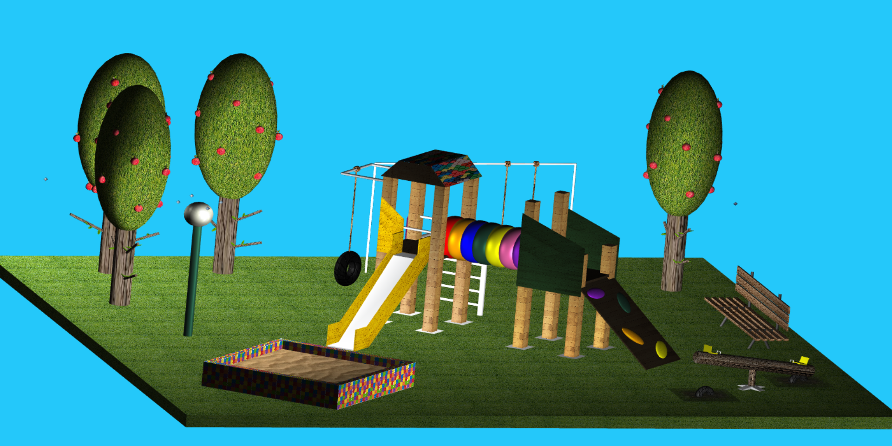
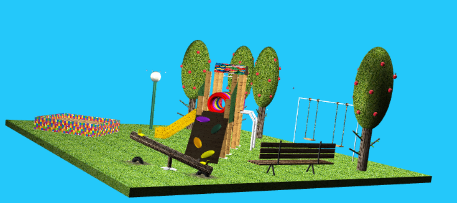
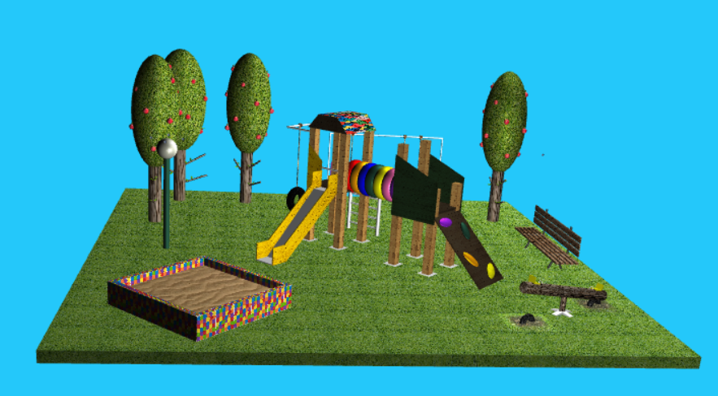
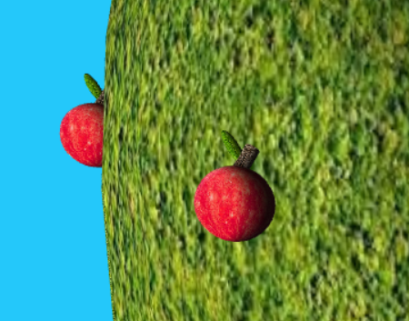

# SGI 2022/2023 - TP1

## Group: T06G05

| Name             | Number    | E-Mail             |
| ---------------- | --------- | ------------------ |
| Beatriz Santos   | 201906888 | up201906888@edu.fe.up.pt |
| Maria Carneiro   | 201907726 | up201907726@edu.fe.up.pt |

----
## Project information

- Parser with error description
- Reutilization of already defined primitives improving XML readibility and lightweightness
- Realistic scene
- Default Cameras for Orthogonal and Perspective views for each primitive, Materials and Textures with Inheritance and Null Reliability
- Realistic scene

- Scene
  - Our scene represents a park with multiple trees, a bench, a double swing, a sand box, a lamp, a see saw swing and a complex playground composed by a ramp, slide, two houses, a tire swing, a climbing stair and a tube.

  ## Screenshots
  
  
  
  
----
## Issues/Problems

- None know bugs, as far as we know.
