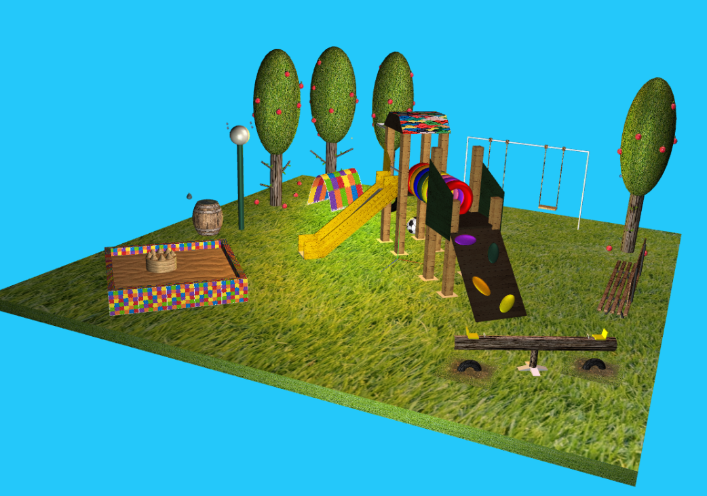
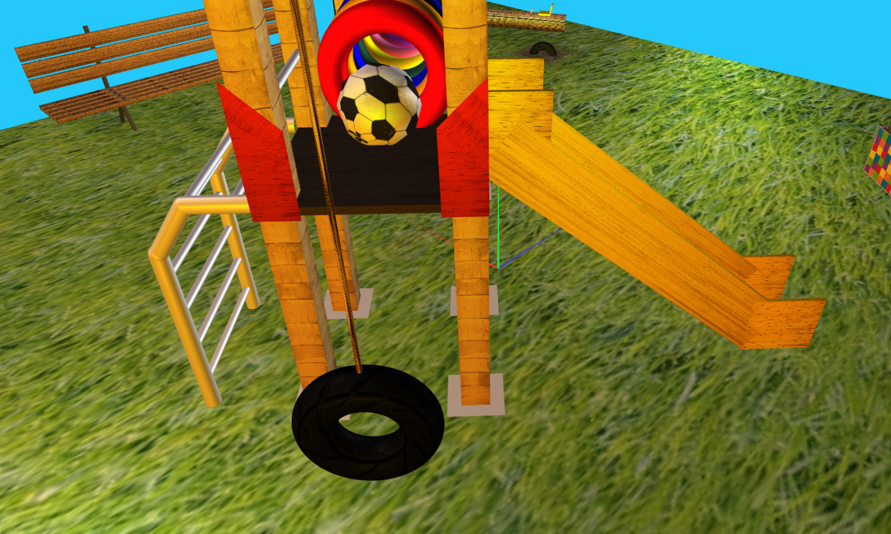
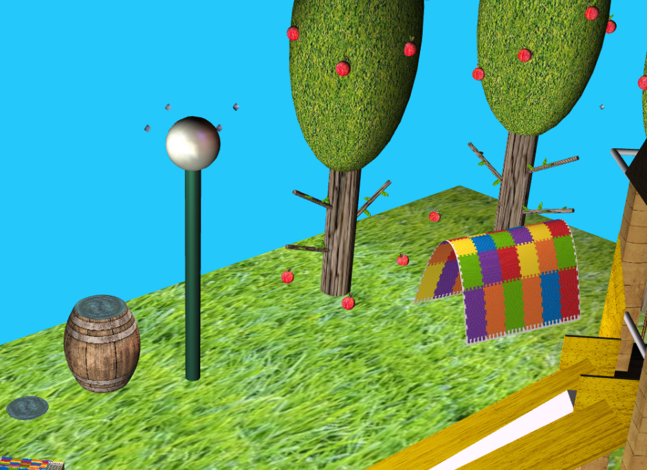
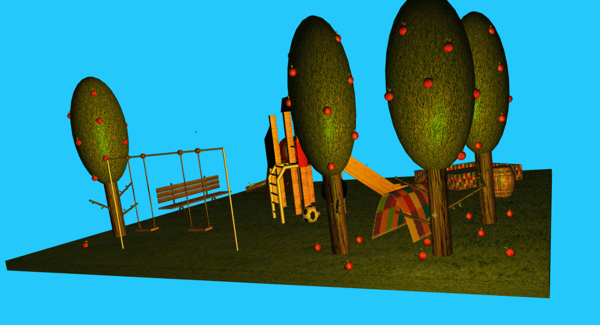

# SGI 2022/2023 - TP2

## Group: T06G05

| Name             | Number    | E-Mail             |
| ---------------- | --------- | ------------------ |
| Beatriz Santos   | 201906888 | up201906888@edu.fe.up.pt |
| Maria Carneiro   | 201907726 | up201907726@edu.fe.up.pt |

----
## Screenshots

## Project information
Besides the scene done in TP1, the following implementations were added:

- Default nurb surfaces for the barrel, tent, sand (rectangle) and ground (rectangle), but also new nurb surfaces such as the inside of the tent, the waterdrop and the sand castle tops, with various degrees (1, 2 and 3).
- Use of shaders for components with the "highlighted" field in which the behaviour of the light is maintained when, on pulsing, it returns to the original colour.
- New colored lights to better see the effect of the light on nurbs surfaces.
- Animated objects inside of other animated objects, like the double swing seats and the playground with the ball, or even the apple trees.

**Scene**

  Our scene represents a ghost park with multiple trees, a bench, a double swing, a sand box, a lamp, a see saw swing, a barrel, a tent and a complex playground composed by a ramp, slide, two houses, a tire swing, a climbing stair and a tube. 
  
  The has multiple animations:
  * A ball that moves inside the tube when the playground is lifted, and then jumps when it hits the ground.
  * A waterdrop that falls on the barrel and then jumps towards the ground.
  * Shaking trees and apples that fall afterwards.
  * Swinging double swing with double seats moving.
  * Seesaw moves up and down.

  It also has multiple highlighted components such as the ball, the sandcastle tops, the tent and it's inside part and the climbing ramp holders.

----
## Issues/Problems

- None know bugs, as far as we know.
